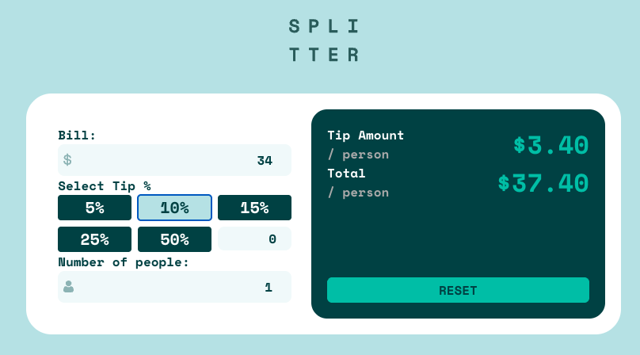

# Frontend Mentor - Tip calculator app solution

This is a solution to the [Tip calculator app challenge on Frontend Mentor](https://www.frontendmentor.io/challenges/tip-calculator-app-ugJNGbJUX).

### Setup

install npm packages : `npm i`

Run local server :`npm run dev`

Run vitest : `npm run test`

### The challenge

Users should be able to:

- View the optimal layout for the app depending on their device's screen size
- See hover states for all interactive elements on the page
- Calculate the correct tip and total cost of the bill per person

### Screenshot

### Links

- [Repo URL](https://github.com/JammiM/tip-calculator-app-ff)
- [Live Site URL](https://jammim.github.io/tip-calculator-app-ff/)

## My process

### Built with

- Semantic HTML5 markup
- CSS custom properties
- CSS Grid

### What I learned

#### Dynamic url links

Making use of the dynamic url links for referencing images

#### Vitest unit testing

### Continued development

I'm planning on integrating "Google lighthouse" and Vitest into the CI / CD pipeline
